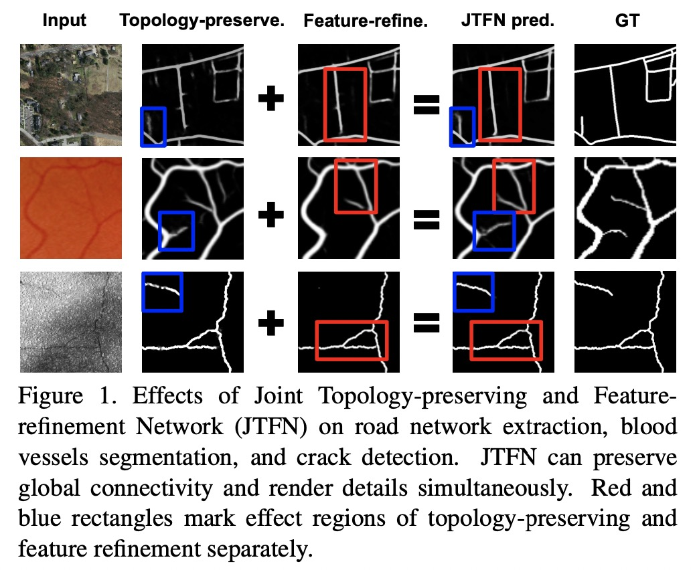

# Implementation of JTFN
Joint Topology-preserving and Feature-refinement Network for Curvilinear
Structure Segmentation  
Mingfei Cheng*, Kaili Zhao*, Xuhong Guo, Yajing Xu, and Jun Guo.  
[Accepted to ICCV 2021](https://openaccess.thecvf.com/content/ICCV2021/papers/Cheng_Joint_Topology-Preserving_and_Feature-Refinement_Network_for_Curvilinear_Structure_Segmentation_ICCV_2021_paper.pdf)

## Abstract
Curvilinear structure segmentation (CSS) is under semantic segmentation, whose applications include crack detection, aerial road extraction, and biomedical image segmentation. In general, geometric topology and pixel-wise features are two critical aspects of CSS. However, most semantic segmentation methods only focus on enhancing feature representations while existing CSS techniques emphasize preserving topology alone. In this paper, we present a Joint Topology-preserving and Feature-refinement Network (JTFN) that jointly models global topology and refined features based on an iterative feedback learning strategy. Specifically, we explore the structure of objects to help preserve corresponding topologies of predicted masks, thus design a reciprocative two-stream module for CSS and boundary detection. In addition, we introduce such topologyaware predictions as feedback guidance that refines attentive features by supplementing and enhancing saliencies. To the best of our knowledge, this is the first work that jointly addresses topology preserving and feature refinement for CSS. We evaluate JTFN on four datasets of diverse applications: Crack500, CrackTree200, Roads, and DRIVE. Results show that JTFN performs best in comparison with alternative methods.   
  
## Method


## Train and Test 
Requirements
```
Python 3.6
Pytorch 1.9.1
```
### dataset
Please download related datasets: [CrackTree200](https://github.com/fyangneil/pavement-crack-detection), [Crack500](https://github.com/fyangneil/pavement-crack-detection), [DRIVE](https://drive.grand-challenge.org/), [Roads](https://www.cs.toronto.edu/~vmnih/data/)  
Data folder structure:  
```
data/
├── split
│    ├──drive
│    │    ├── train.txt
│    │    └── test.txt
│    └──...
└── other data process files
datasets/
├── DRIVE
│   ├── images
│   │   ├── img1.tif
│   │   └── ...
│   ├── annotation_mask
│   │   ├── img1.png
│   │   └── ...
│   ├── annotation_boundary
│   │   ├── img1.png
│   │   └── ...
│   └── others
└── ...
```
We provide our script to generate boundary labels from annotations, your can run (Replace the folder path in brackets below):
```
python tools/produce_boundary.py --mask [annotation folder path] --save [generated boundary labels' path]
```
### train
Please modify the config and run:  
`sh train_jtfn.sh`
### test
Please modify the config and run:   
`sh test_jtfn.sh`  

## Citation
If you use this code and our results for your research, please cite our paper.
```
@inproceedings{JTFN_ICCV_2021,
  title={Joint Topology-preserving and Feature-refinement Network for Curvilinear Structure Segmentation},
  author={Cheng, Mingfei and Zhao, Kaili and Guo, Xuhong and Xu, Yajing and Guo, Jun},
  booktitle={ICCV},
  year={2021}
}
```

